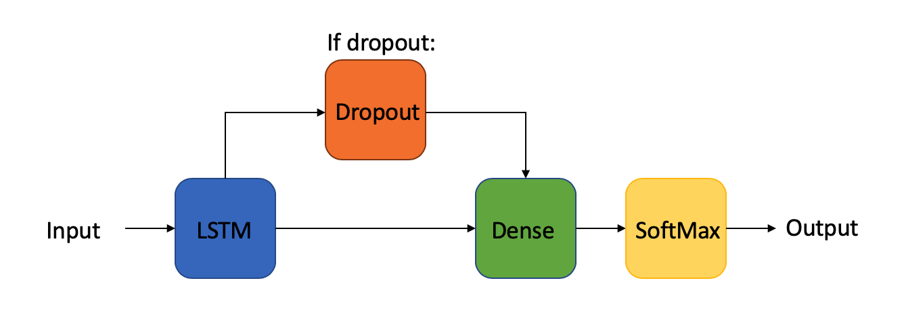
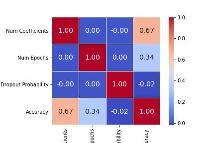
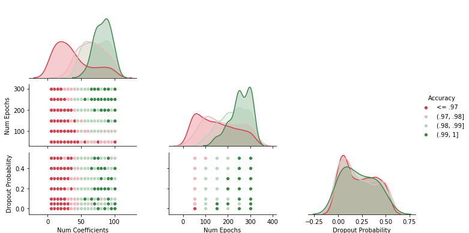

# Learning-Tones

This open sourced project is focused on creating auditory feedback by effectively categorizing user speech into one of the four tones of Mandarin Chinese. This will enhance language learning with real-time pronunciation feedback. There already exists a plethora of sources to aid in memorizing vocabulary and understanding grammar, yet few for real-time pronunciation without the addition of an instructor or large price tag. This serves as a supplementary source that can provide quick and informative auditory feedback for tonal monosyllabic words. 

# Collecting and Pre-Processing Data

Access was gained to the large dataset: [Tone Perfect: Multimodal Database for Mandarin Chinese](https://tone.lib.msu.edu). This data set includes utterances of 410 monosyllabic words spoken in each of the four tones by six individuals (three male and three female) -- 9,860 audio files total. The data was ultimately transformed from .mp3 formatted files into two saved .npy formatted files included in the project folder: one for labeling tones and one for 100 Mel-ceptrum coefficients across time for each audio file. The number for Mel-ceptrum coefficients was initially chosen to be large enough for hyperparameter testing later on. Feature extraction was focused on  Mel-frequency coefficients (MFCCs). Extraction was done using a python audio analysis tool, librosa. In order to control for variance in audio file duration, the time dimension for each audio file was appropriately padded with zeros. The data was randomly split between training, testing, and validation data, respectively 60, 20, and 20\% of the original data. 

# The Model
Given that the data is non-linear, sequential across time, and labeled, we chose to use a RNN, more specifically, a Long Short Term Memory model (LSTM). As supervised learning algorithms, these are specifically useful for unsegmented, continuous speech. 



The model was trained on training data and validation data. Initial parameter testings showed that a fine-tuning of the hyper-parameters was necessary for full optimization. 

## Optimization 
Adjustments to these hyper-parameters were done to optimize the model: number of MFCCs, number of epochs, and dropout rate. To better understand the relationship between all of these and their effect on accuracy. The top sets of hyper-parameters were chosen based their accuracy scores when models were trained and tested on validation data. The top performers, for which there were 5, were selected by setting an exclusive threshold at 0.9935.




As seen in the figures above, all the top scoring models had more than 250 epochs and 60 coefficients. The top performing models were selected to move onto the next stage: 10-fold cross-validation. Cross validation was done on the whole dataset, for each of the 5 top performers. The set of hyper-parameters that scored the highest accuracy after cross validation was chosen as the optimal model.

## Final Adjustments

The optimal model had a mean accuracy of 0.981 during cross validation. This model's hyper-parameters were: 80.0 coefficients, 250.0 epochs, and a 0.3 dropout rate. The optimal model was then retrained on the data and its weights saved to a JSON file for future use. 

# User Interface

User's should interact with the notebook ("LearningTones.ipynb") through this section, which is located towards the bottom of the page. 

Additional files needed for download:
1. "requirememts.txt"
2. "model_spec.txt"
3. "model.h5"
4. "model.json"

## Opening LearningTones.ipynb
First, downlowd all the files as well as the notebook into a folder or location together. Since this is a jupyter notebook, it can best be run from the termial/command prompt. If one does not have jupyter notebooks installed, they can use [google's online notebook service](https://cloud.google.com/ai-platform-notebooks/) through their google account, another IDE that is jupyter notebook compatible (ex: canopy), or by installing jupyter notebooks. The latter is the easiest and can be done through the command prompt by entering the following: 
```
pip install notebook
``` 
Once installed, either open up jupyter notebooks through the terminal by entering 
```
jupyter notebook
```
and navigating to the where "LearningTones.ipynb" is located on your disk or cd to the location where "LearningTones.ipynb" is and entering 
```
jupyter notebook LearningTones.ipynb
```
in the command prompt. Jupyter notebooks will open on a web browser page, but no fear, it does not require the internet-- it uses a port on the local host (your computer) to run on the browser page. [This website](https://jupyter-notebook-beginner-guide.readthedocs.io/en/latest/execute.html) will be helpful in getting jupyter notebooks up and running if you are facing any issues. 

Whenever I refer to "running" cells (i.e blocks of code), I just mean clicking the the little play button located at the top of the page. If you find any issues, how to navigate jupyter notebooks itself can be found [here](https://www.codecademy.com/articles/how-to-use-jupyter-notebooks).

## Importing packages and the trained classifying model
All imports that are needed are included under the import section. You will need the "requirememts.txt" file in order to install certain packages. There has been reportted issues on Windows computers installing librosa. This can be potentially solved by openening the command prompt/ terminal, write the line 
```
pip install librosa --user
```
The package should be installed properly after that. If there are any issues feel free to email me at tburke3@wellesley.edu, and we can work on getting you the necessary packages to run the file. From there, the user needs to run the "Load in the model" section. This will load in the model that was previously found to be optimal for classifying tones. Luckily, it is already saved and the user does not have to retrain it-- it just needs to be compiled! When done compiling it, it will print out details about the model. 

## Classifying audio
Finally, you are ready to start classifying your audio into the four tones of Mandarin Chinese. 

- [ ] **Create folder to hold user audio**
> You will create a folder to hold all your audio files. This just creates a folder to store the audio recordings for the  
> current session. In case you want to always be able to refer back to your learning over time, do the following: remove the 
> line shutil.rmtree(user_audio_directory) under **Create folder to hold user audio** and all the code under the section
> titled > **Delete all user recordings**. 

- [ ] **Record user's voice**

> You will be able to record your voice for 1.4 seconds. You will be prompted when to start recording and told when you are 
> done recording. 

- [ ] **Plot, playback, and prediction of user recording**

> If you are satisfied with your recording, you can have it played back to you, plotted by a waveform for visualization, and
> be given real time auditory feedback from the model by its predicting the tone and reporting the accuracy. The model itself
> has an accuracy of ~98.10% across classifying ~10,000 monosyllabic Mandarin words in 10-fold cross validation, so it is 
> pretty accurate! You can toggle between this section and the section above as many times as they like! 

- [ ] **Delete all user recordings**
> At the end, you can delete all recordings for storage space purposes by running the last block of code.  

:+1: Have fun and good luck in learning Mandarin tones!

